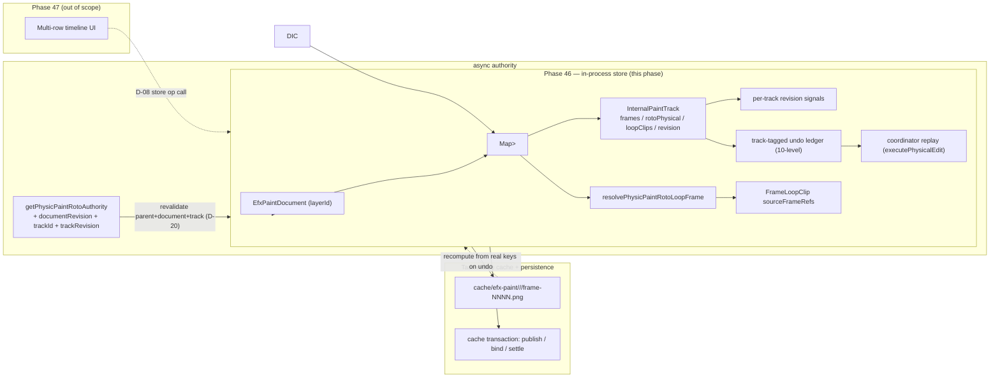

# Phase 46: Track-local Paint/Roto/PlayScript State, Loop Clips, and Caches - Research

**Researched:** 2026-08-23
**Domain:** In-process store/state engineering (Preact Signals + Tauri bridge) — EFX Physic Paint document track-local addressing
**Confidence:** HIGH

## Summary

Phase 46 converts the EFX Physic Paint runtime state from parent-layer/frame addressing into `parentLayerId → trackId → frame` addressing inside the v1.0 document built in Phase 45. The good news is that **most of the track-local skeleton already exists in the document model** — `InternalPaintTrack` carries `id`, `revision`, `frames`, `rotoPhysical`, and `loopClips` (`[VERIFIED: app/src/efx-paint/document/efxPaintDocument.ts:47-59]`), `EfxPaintDocument` already carries `documentRevision`, `activeTrackId`, `tracks`, and `compositeRevision` (`[VERIFIED: app/src/efx-paint/document/efxPaintDocument.ts:71-80]`), and `FrameLoopClip` already models Hold clips via `sourceFrameRefs`/`sourceKind: 'playscript-hold'` (`[VERIFIED: app/src/efx-paint/document/efxPaintDocument.ts:30-37]`). The work is therefore **not schema-building** — it is (1) re-keying the runtime stores from `Map<layerId, …>` to `Map<layerId, Map<trackId, …>>`, (2) splitting the two global revision counters into per-track signals, (3) relaxing the Phase 45 single-track serializer constraints, (4) extending the layer-scoped undo ledger and async authority to be track-scoped, and (5) embedding `trackId` in the cache sidecar path so track deletion can remove its PNGs atomically.

Two factual corrections to the 46-CONTEXT.md file map surfaced during research and are recorded in the Assumptions Log: the Loop Clip resolver is **not** `physicsPaintRotoLoopClips.ts` (that file does not exist) — the resolver is `resolvePhysicPaintRotoLoopFrame` exported from `physicsPaintRotoPhysicalResolver.ts:5570`, and it already returns a fail-closed `'linked-unresolved'` resolution kind that implements D-13 source-missing semantics. Second, the CONTEXT `Code Context` claim that `paintStore.ts` becomes track-local conflicts with the Phase 45 locked naming: `paintStore.ts` is the inline **EFX Paint** store (out of scope, unchanged per the naming contract); the track-local Paint frames for Physic Paint belong to `physicPaintStore._frames` and the engine carrier.

No new external dependencies are required. Every pattern Phase 46 needs already exists and is proven in-repo: the Loop Clip resolver, the reference-based 10-level undo ledger, the fail-closed authority revalidation, the staging/commit cache transaction, the deterministic revision builders, and the PNG sidecar scheme. The single biggest planning risk is **not** new machinery — it is mis-scoping: the phase touches the same files (`physicPaintStore.ts`, `physicPaintBridge.ts`, `rotoCoordinatorPorts.ts`) that carry the live Roto/PlayScript surface, so the planner must sequence the re-keying so it never lands a half-track-scoped runtime against the still-single-track Phase 45 document serializer.

**Primary recommendation:** Re-key `physicPaintStore` runtime Maps to `Map<layerId, Map<trackId, …>>` and drive per-track reactivity through a **per-track signal map** (not a single counter), reuse `resolvePhysicPaintRotoLoopFrame` for Hold clips, keep the undo ledger reference-based with the 10-level cap but tag each entry with `trackId`, extend the bridge authority to carry `documentRevision + trackId + trackRevision`, and add `trackId` into `buildEfxPaintFrameCachePath` before any track-deletion task is written.

## Architectural Responsibility Map

| Capability | Primary Tier | Secondary Tier | Rationale |
|------------|-------------|----------------|-----------|
| Track-local state storage (`layerId→trackId→frame`) | In-process store (`physicPaintStore`) | Native cache sidecars | The store is the single runtime owner; the cache is the durable projection |
| Per-track revision + dirty + `paintVersion` | In-process store (per-track signals) | Deterministic revision builders | Track edits must be observable per track without over-broad subscription (Pitfall 4) |
| Track-aware Undo/Redo | Store + history ledger (App) | Bridge coordinator replay | Entries are refs + revision hash; replay goes through the coordinator (`executePhysicalEdit`) |
| Loop Clip / Hold resolution | Module (`physicsPaintRotoPhysicalResolver`) | Document `FrameLoopClip` | Reuse existing `resolvePhysicPaintRotoLoopFrame`; never build a second scheduler |
| Cross-track copy/paste/duplicate/move | Store-level data ops | Fresh-identity rail-set rules | Pasted items get fresh identities; Hold clips re-point fail-closed |
| Async PlayScript/Reveal authority | Coordinator + bridge | Store | `getPhysicPaintRotoAuthority` is the only commit authority; extend message with track revision |
| Track CRUD + deletion | Store + cache transaction | Native command | Acknowledge-and-delete must remove track + PNG sidecars in one transaction |
| Flattened composite output | Composite revision signal | Phase 48 compositor | Phase 46 only maintains `compositeRevision` bumps; actual flatten is Phase 48 |

<user_constraints>
## User Constraints (from CONTEXT.md)

### Locked Decisions

#### Track-aware Undo/Redo (TRK-04)
- **D-01:** Undo/redo is a **unified document-wide stack**; each entry is tagged with the `trackId` it mutated. Undo always targets the exact track that produced the edit and never touches another track's history (meets acceptance "Undo/redo targets the exact internal track"). — **Reversibility:** costly — splitting to per-track stacks later would need the history model re-keyed and cross-track action routing redesigned.
- **D-02:** Undo depth keeps the **10-level operation-count cap** (the accepted Roto Undo model). Paint and PlayScript edits also feed the same capped stack.
- **D-03:** Undo entries store **references + the prior deterministic revision hash** (revision builders already built in Phase 45), NOT raster bytes (Pitfall 17). Cached frames are recomputed from real keys on restore. — **Reversibility:** one-way — switching to snapshot-based undo later would change memory and cache-divergence guarantees the recompute design provides.
- **D-04:** Undoing an entry that targets a **non-active track auto-activates the target track**, so the user sees the affected track.

#### Cross-track copy/paste semantics (TRK-04)
- **D-05:** Pasted items always get **fresh identities** (the v0.9 rail-set rule) — paste is a deep, self-contained copy that never links back to the source track.
- **D-06:** A Hold Loop Clip pasted across tracks is **re-pointed to the destination track's own copied source frames** (fresh identity, never a cross-track reference). If re-pointing is impossible (e.g. partial selection where the source frames are not part of the paste), the paste is **rejected explicitly** — never a dangling or foreign-track reference.
- **D-07:** Cross-track paste **deep-copies the underlying source frame assets**, so the destination track is fully self-contained (editable/reordered/deleted with zero effect on the source, TRK-06/07). The "no durable asset duplication" contract applies ONLY to linked repeats INSIDE one Loop Clip; a paste is new independent content, so duplication is expected.

#### Cross-track drag (data op)
- **D-08:** Phase 46 implements the **store-level cross-track move operation** (re-tag `trackId`, preserve frame timing); the **drag gesture arrives in Phase 47** with the multi-row timeline. Phase 46 exposes the data primitive the Phase 47 UI calls.
- **D-09:** Cross-track move behaves exactly as **copy-paste-delete**: fresh identities in the destination, source items removed, references re-pointed under the same paste rules (fail-closed for Hold clips).

#### Hold linked-source semantics (TRK-08)
- **D-10:** A Hold source is a **live single source-of-truth**: one real frame on the owning track; every linked occurrence (Loop Clip `sourceFrameRefs`) renders live **by reference — never a copy**.
- **D-11:** A Hold occurrence is **strictly a live reference** — no per-occurrence override. Editing a Hold frame means editing the source.
- **D-12:** Editing the source frame performs **atomic invalidation + recompute**: one revision bump invalidates the owning track's cache and every linked occurrence across the document.
- **D-13:** If the source frame is deleted or cleared, linked occurrences **fail-closed**: the Loop Clip is flagged source-missing and renders nothing/placeholder until the source is restored — never silently falls back to a stale copy.

#### Track deletion + assets (TRK-07)
- **D-14:** Deleting a track that holds accepted cache assets is **acknowledge-and-delete**: an explicit dialog states how many accepted frames will be removed; confirming removes the track AND its cached PNG sidecars. Fail-closed here means the action is explicit, not blocked.
- **D-15:** On acknowledged delete, the track's cached **PNG sidecars are deleted in the same transaction** as the track removal (no orphaned files).
- **D-16:** If another track's Hold/Loop references this track's frames, deletion **severs the references first**: the dependent occurrence is re-pointed or flagged source-missing (per D-13), then the track deletes.
- **D-17:** Deleting the **last Paint track is refused** — a document must always have at least one Paint track (Phase 45 invariant: one default Paint track + fixed Background track). The delete is blocked with a message.
- **D-18:** When the active track is deleted, the **nearest adjacent Paint track** (closest by order/row) becomes the new active track, keeping the active track unambiguous (TML-03).

#### Async work on track switch (TRK-05, TRK-06)
- **D-19:** Async PlayScript/Reveal **captures its target track at the moment the operation starts**. If the user switches tracks mid-flight, the work **completes on the original captured track** (after revalidation) — non-destructive to the new selection.
- **D-20:** Before commit, async work **revalidates parent + document + track revision**; on any mismatch, OR if the target track is no longer present, it **fails closed** — discards, no partial write.

### Claude's Discretion
- Exact store/function shape for the track-local addressing extension (`paintStore.ts`, `physicPaintStore.ts` → `Map<layerId, Map<trackId, …>>`), per-track revision/dirty flags, and the per-track `paintVersion` split from the current single global `rotoPhysicalRevision`.
- Where the new track-local state lives in `app/src/efx-paint/` vs. the existing `physic-paint/` store tree (research recommends extending the stores; researcher finalizes).
- Exact acknowledge-delete dialog copy (must be plain and explicit per D-14).
- Undo entry serialization details (refs + revision hash shape) within the 10-level cap.

### Deferred Ideas (OUT OF SCOPE)
- **Multi-row timeline + drag gesture UI** (the actual drag interaction, filmstrip, and track CRUD controls) — **Phase 47** (D-08/D-09).
- Per-track opacity/blend/hide/solo controls that consume the track-local state — **Phase 47** (timeline controls), compositor application **Phase 48**.
- Independent per-track transforms / track effects stacks — research "Defer (v2+)" list, future milestone.
</user_constraints>

<phase_requirements>
## Phase Requirements

| ID | Description | Research Support |
|----|-------------|------------------|
| TRK-01 | Each internal Paint track owns its Paint frames, Roto real keys, generated interpolation, Script Motion, and PlayScript output | `InternalPaintTrack` already carries `frames`/`rotoPhysical` in the document model; the runtime `physicPaintStore` must re-key `_frames`/`_realKeyRecords`/`_interpolationState`/`_scriptMotion` to `Map<layerId, Map<trackId, …>>` |
| TRK-02 | Each internal Paint track owns linked Hold Loop Clips and a shared Loop Clip resolver | `FrameLoopClip` `sourceKind: 'playscript-hold'` + `resolvePhysicPaintRotoLoopFrame` (modulo/finite/infinite, next-clip interruption, `linked-unresolved` fail-closed) — reuse, do not rebuild |
| TRK-03 | Per-track revision + dirty state with track-aware cache invalidation | Split `rotoPhysicalRevision`/`physicPaintVersion` into per-track signals; embed `trackId` in `buildEfxPaintFrameCachePath`; D-12 atomic invalidation |
| TRK-04 | Copy/cut/paste/duplicate/clear/undo/redo are track-aware | Fresh-identity paste (D-05/D-06/D-07), store-level cross-track move (D-08/D-09), unified track-tagged 10-level undo stack (D-01–D-04) |
| TRK-05 | Async PlayScript/Reveal revalidates parent, document, track revision before commit | Extend `getPhysicPaintRotoAuthority` messages with `documentRevision + trackId + trackRevision`; D-19/D-20 capture + fail-closed revalidate |
| TRK-06 | Editing one track never changes another track's real keys or caches; stale async cannot commit to another selected track | Track-scoped leases + revision checks; D-19/D-20; `'Roto authority became stale'`-style fail-closed already proven in `applyCanvas` |
| TRK-07 | Track deletion cannot orphan accepted assets silently | D-14/D-15 acknowledge-and-delete with cached PNG sidecars in same transaction; D-16 sever refs; D-17 last-track refusal; D-18 active-track neighbor |
| TRK-08 | Editing one Hold source frame updates every linked occurrence without duplicating assets | D-10/D-11 live single source-of-truth; D-12 one revision bump → track cache + all linked occurrences; D-13 fail-closed source-missing |
</phase_requirements>

## Standard Stack

### Core

This phase is a **pure in-repo state-layer extension**. No new libraries are added or recommended. The "stack" is the proven machinery the project already ships:

| Library / Module | Version | Purpose | Why Standard |
|------------------|---------|---------|--------------|
| `@preact/signals` (in-repo) | existing | Reactive per-track revisions/dirty + `paintVersion` | Project convention (CLAUDE.md): prefer Signals over `useState`/`useEffect`; `signal`/`computed`/`effect` are the established reactive primitives |
| `physicPaintStore` (in-repo) | existing | Track-local runtime ownership (`_frames`, roto records, loop clips, leases) | The sole store already owned by all Physic Paint runtime state; re-key it rather than fork |
| `efxPaintStore` (in-repo) | existing | Document store + serialize/hydrate seams | Phase 45 built it; must relax the single-track constraint (`efxPaintStore.ts:82,118`) |
| `efxPaintDocumentRevision.ts` (in-repo) | existing | Deterministic document/track/composite revision builders | Undo (D-03) and async authority (D-20) use these hashes; already built and canonical |
| `physicsPaintRotoPhysicalResolver.ts` (in-repo) | existing | Loop Clip + per-frame resolution | `resolvePhysicPaintRotoLoopFrame` is the one-and-only resolver; reuse verbatim for Hold clips |
| `useRotoPhysicalEditHistory.ts` (in-repo) | existing | Reference-based 10-level undo/redo ledger | Extend to track-tagged unified stack (D-01..D-04), keep cap + snapshot shape |
| `physicPaintBridge.ts` (in-repo) | existing | Async authority + request/result transport | Extend message contract with `trackId`/`trackRevision`/`documentRevision` |
| `efxPaintPersistence.ts` (in-repo) | existing | `cache/efx-paint` + `.efx-paint-staging-` scheme | Add `trackId` to `buildEfxPaintFrameCachePath` for D-15 sidecar deletion |
| Vitest (in-repo) | existing | Unit tests | `.planning/config.json` Nyquist validation; CLAUDE.md mandates `vitest run` (never watch) |

### Supporting

| Module | Purpose | When to Use |
|--------|---------|-------------|
| `rotoCacheTransactions.ts` | publish/settle/rollback cache generation | Track deletion (D-15) and undo cache recompute (D-03) |
| `physicsPaintRotoRailSetCopy.ts` / `physicsPaintRotoScriptClipboard.ts` | fresh-identity copy/paste primitives | D-05/D-06/D-07 cross-track paste semantics |
| `physicsPaintRotoKeyController.ts` | real-key add/remove | The set of ops that get track-tagged for undo |
| `physicsPaintRotoScriptLibrary.ts` / `physicsPaintRotoScriptSchema.ts` | PlayScript presets/schema | PlayScript output moves to track-scope; scripts themselves stay global library |

### Alternatives Considered

| Instead of | Could Use | Tradeoff |
|------------|-----------|----------|
| Re-keying `physicPaintStore` in place | Build a parallel `efx-paint/runtime/` store from scratch | In-place keeps one authority and avoids duplicating the proven lease/stale-rejection machinery; a parallel store would fork two sources of truth for the same state |
| Per-track signal map for revision | One global `rotoPhysicalRevision` counter + track-filtered subscribe | Global counter over-subscribes every subscriber on any track edit (Pitfall 4); a `Map<trackId, Signal<number>>` gives granular reactivity at the cost of Map lifecycle cleanup |
| Reference-based undo (D-03) | Snapshot-based undo storing PNG bytes | D-03 is locked (references + revision hash); bytes would blow memory at 10 levels and diverge from the recompute guarantee |

**Version verification:** No external packages are introduced; all modules above already exist in `app/src/` under the pinned workspace dependencies. There is nothing new to `npm view`.

## Package Legitimacy Audit

> This phase installs **no external packages**. The Package Legitimacy Gate is therefore satisfied vacuously — there are no new registries, no postinstall scripts, no slopsquat risk. All implementation uses in-repo modules already present in the workspace `package.json` dependencies (`@preact/signals`, `vitest`, etc.). The planner must not add any new `npm install`/`pnpm add` task to this phase.

| Package | Registry | Age | Downloads | Source Repo | Verdict | Disposition |
|---------|----------|-----|-----------|-------------|---------|-------------|
| _none introduced_ | — | — | — | — | — | No packages added |

**Packages removed due to [SLOP] verdict:** none
**Packages flagged as suspicious [SUS]:** none

## Architecture Patterns

### System Architecture Diagram



### Recommended Project Structure

No new top-level directories required. The track-local runtime extension belongs in the existing store and module trees:

```
app/src/
├── stores/
│   ├── physicPaintStore.ts        # RE-KEY: _frames, roto records, caches -> Map<layerId, Map<trackId, ...>>
│   └── efxPaintStore.ts           # RELAX single-track constraint (82, 118); keep document authority
├── efx-paint/
│   └── document/
│       ├── efxPaintDocument.ts          # unchanged (already track-shaped)
│       └── efxPaintDocumentRevision.ts # reuse builders
├── lib/
│   ├── physicPaintBridge.ts            # + documentRevision/trackId/trackRevision in authority messages
│   └── efxPaintPersistence.ts          # + trackId in buildEfxPaintFrameCachePath
└── components/physic-paint/
    ├── roto/physicsPaintRotoPhysicalResolver.ts  # reuse; no fork
    └── hooks/useRotoPhysicalEditHistory.ts        # + trackId tag on entries
```

### Pattern 1: Track-local addressing `layerId → trackId → frame`

**What:** Every runtime map is keyed by `layerId` first, then `trackId`, then frame index. Every cache key embeds `trackId`. Reorder never rewrites IDs (stable UUIDs).

**When to use:** All store mutations and reads in this phase.

**Example (target shape after re-key; source of the current single-dimension shape):**
```ts
// CURRENT (single dimension, verified lines 39/152 of physicPaintStore.ts):
export const physicPaintVersion = signal(0);
export const rotoPhysicalRevision = signal(0);

// TARGET (recommended per-track shape):
export const physicPaintVersion = signal(0);                       // global event clock (bump on any mutation)
const trackRevisions = new Map<string, { paint: Signal<number>; roto: Signal<number> }>(); // per-track reactive

export function bumpTrackRevision(layerId: string, trackId: string): void {
  const entry = trackRevisions.get(trackId);
  if (entry) { entry.paint.value = entry.paint.value + 1; entry.roto.value = entry.roto.value + 1; }
  physicPaintVersion.value = physicPaintVersion.value + 1;          // "always bump AND subscribe a paintVersion"
  _rotoPhysicalStructuralCache.delete(layerId);                      // existing structural memo cleared
}
```
*Note: the document `InternalPaintTrack.revision` / `FrameLoopClip.revision` fields (`efxPaintDocument.ts:56,36`) are the durable revision hash (`buildEfxPaintTrackRevision`) and must NOT be conflated with the runtime signal counters.*

### Pattern 2: Reference-based track-tagged undo (D-01..D-04)

**What:** One unified document-wide ledger; each entry stores `{ trackId, beforeSnapshot, afterSnapshot }` where snapshots are refs + prior deterministic revision hash (NOT pixel bytes). Undo replays the target-track state through the coordinator; a non-active target auto-activates (D-04); eviction caps at 10 operations.

**Source of the existing cap + snapshot shape:** `useRotoPhysicalEditHistory.ts` (`trimAppliedHistory` evicts past 10; snapshots carry `records`, `loopClips`, `interpolation`, `groupOverrideRecords`, `incomingInterpolationBreakKeyIds`; replay through `executePhysicalEdit({operationKind:'undo'|'redo'})`).

**What to change:** The current identity is `launchOperationId + layerId + projectContextId + capacity` (layer-scoped). Phase 46 adds `trackId` to each entry identity and to the snapshot association, so `undo` targets only the exact track that produced the edit.

### Pattern 3 — Revision-based async authority (D-19/D-20)

**What:** The only commit authority (`getPhysicPaintRotoAuthority`) captures `{ documentRevision, trackId, trackRevision }` at operation start; before commit it revalidates parent-layer + document + track revision against the current store; any mismatch (or missing track) → discards, no partial write. This is the Phase 43.4 `physicPaintBridge` fail-closed pattern extended to three dimensions.

**Source:** `physicPaintBridge.ts` existing request/result; `physicsPaintRotoController.ts` `ports.commit(publication, revalidateUnderLease)`. The `linked-unresolved` fail-closed state from `resolvePhysicPaintRotoLoopFrame` implements D-13 source-missing behavior today for the Roto model.

### Anti-Patterns to Avoid

- **Re-writing the Loop scheduler** — a second resolver diverges from the proven modulo/finite-infinite/next-clip logic and breaks Hold parity. Reuse `resolvePhysicPaintRotoLoopFrame` (default) with `sourceKind:'playscript-hold'` Loop Clips.
- **Storing PNG bytes in undo** — D-03 rejects; store refs + prior deterministic revision hash and recompute from real keys on restore.
- **Per-track stacks** — D-01 explicitly locks a unified stack with `trackId` tags; per-track stacks require re-keyed history and re-routing (already documented as costly, not wanted).
- **Single global `rotoPhysicalRevision`** — over-subscribes; Split per track (per-track signal map) with a global clock for the store-level version.
- **Editing `paintStore.ts` (inline EFX Paint)** — it is the inline Basic/FX layer store, out of scope per the locked naming contract. Track-local Paint frames for Physic Paint live in `physicPaintStore`.

## Don't Hand-Roll

| Problem | Don't Build | Use Instead | Why |
|---------|-------------|-------------|-----|
| Hold/Loop frame resolution | A second scheduler | `resolvePhysicPaintRotoLoopFrame` | Modulo, finite/infinite, next-clip interruption, half-open intervals, and `linked-unresolved` fail-closed are already implemented and tested |
| Undo/redo history | A new history manager | Extend `useRotoPhysicalEditHistory` | 10-level cap, reference-based snapshots, and coordinator replay are proven; add `trackId` tag only |
| Deterministic revisions | Re-parse everything | `buildEfxPaintTrackRevision` / `buildEfxPaintCompositeRevision` | Canonical encoder + empty-collection-empty-term semantics already built in Phase 45 |
| Cache generation staging/commit | Ad-hoc filesystem writes | `rotoCacheTransactions.ts` publish/commit/settle | Cross-resource transaction + rollback semantics already proven |
| Cache path safety | Raw path joins | `isSafeEfxPaintCachePath` + extend `buildEfxPaintFrameCachePath` with `trackId` | Prefix-locked guard prevents path escape |
| Async authority | Trusting a late renderer result | Existing lease + stale-revision reject | Phase 43.4 proved fail-closed authority; extend to 3 dimensions |

**Key insight:** Every deceptively-complex primitive (resolver, history, authority, transaction, revision) already exists and has tests. Custom reimplementations would each re-import the bugs those tests guard against.

## Runtime State Inventory

Phase 46 re-addressing is a **runtime state restructure**, not a pure rename, so runtime state must be explicitly inventoried.

| Category | Items Found | Action Required |
|----------|-------------|------------------|
| Stored data (on-disk) | `.mce` documents already track-shaped (Phase 45) — no migration of existing v1.0 files | none (document format is already `layerId → tracks[]`; the runtime re-key does not change the saved shape) |
| Live in-memory store state | `physicPaintStore`: `_frames`, `_rotoRealKeyRecords`, `_rotoGroupOverrideRecords`, `_rotoPhysicalInterpolationState`, `_rotoPhysicalLoopClips`, `_rotoPhysicalIncomingInterpolationBreakKeyIds`, `_rotoCacheMetadata`, `_rotoGeneratedCacheMetadata`, `_rotoPlaybackSettings`, `_rotoPhysicalOperationLeases`, `_rotoPhysicalStructuralCache` — all currently keyed by `layerId` (single-track implicit) | Re-key each to `Map<layerId, Map<trackId, …>>`; the structural cache memo key must include `trackId` |
| In-flight async leases | `_rotoPhysicalOperationLeases` (per layer) and the coordinator commit lease | Extend lease identity with `trackId`; on track delete, cancel/expire leases for that track (D-16) |
| Bridge message contract | `physicPaintBridge` request/result types lack `trackId`/`trackRevision`/`documentRevision` | Add fields; validate presence (reject requests missing track context) |
| Undo ledger | `useRotoPhysicalEditHistory` snapshots currently layer-scoped | Tag each entry with `trackId`; keep 10-level cap |
| OS-registered state | None — this phase introduces no OS registrations | None |
| Secrets / env vars | None | None |
| Build artifacts | None | None |

## Common Pitfalls

### Pitfall 1: Track identity drift / array-index addressing
**What goes wrong:** Code uses `tracks[i]` instead of `trackId`; reordering a track rewrites IDs and breaks every linked Loop Clip, cache key, and undo snapshot.
**Why it happens:** The single-track Phase 45 code uses `tracks[0]` directly.
**How to avoid:** Every mutation takes `trackId`; `order` is a sort key, never an identity. Mirror `efxPaintStore` single-track checks but keyed by `id`. (Milestone Pitfall 1.)

### Pitfall 2: Stale async work writing to a newly selected track
**How it happens:** D-19/D-20. Async PlayScript starts on track A; user selects track B; if the commit path reads the *current* active track instead of the captured one, the result lands on the wrong track (TRK-06).
**How to avoid:** The authority and the commit both carry the captured `trackId`; revalidation compares the captured `documentRevision`/`trackRevision` against the current store — mismatch → fail closed, no write. Do not read "active track" at commit time.

### Pitfall 3: Global `paintVersion` collapsing per-track invalidation
**How to avoid:** Every cache key embeds `trackId` and per-track signals; one global bump would invalidate all tiles on any track edit (Pitfall 4). Recommended: per-track signal map, plus a global clock for the store-level.

### Pitfall 4: Loop asset duplication
**How to avoid:** Linked Hold occurrences render by reference — never copy the source frame bytes. The "no durable asset duplication" contract applies only to the repeated occurrences of ONE Loop Clip; paste (D-07) is new content and may duplicate.

### Pitfall 5: Undo restoring a snapshot that conflicts with the document
**How to avoid:** Snapshots are refs + the *prior deterministic revision hash* (D-03). On undo, replay through the coordinator which revalidates against the current revision before write; if the current state no longer matches the referenced revision, recompute from real keys. (Milestone research Pitfall 17.)

### Pitfall 6: Deleting a track that is referenced by another track's Hold clip
**Why it happens:** Silent fallback to a stale copy is the tempting implementation.
**How to avoid:** D-16 severs references first (re-point to destination's copied frames or flag source-missing per D-13), then delete. `linked-unresolved` state already gives the placeholder.

### Pitfall 7: Deleting cached sidecars outside the cache transaction
**Why it happens:** A manual `rm` of track PNGs bypasses the transaction.
**How to avoid:** D-15 deletion goes through the `publish/commit/settle` cache transaction; the track's sidecar paths (now including `trackId`) are removed in the same transaction as the store re-key — no orphan files.

## Code Examples

### Verified: The document model is already track-shaped (source of truth)
```typescript
// Source: app/src/efx-paint/document/efxPaintDocument.ts:47-59 (Phase 45)
export interface InternalPaintTrack {
  readonly id: string;
  readonly name: string;
  readonly order: number;
  readonly visible: boolean;
  readonly solo: boolean;
  readonly opacity: number;
  readonly blendMode: BlendMode;
  readonly revision: number;
  readonly frames: Readonly<Record<number, CachedFrameReference>>;
  readonly rotoPhysical: PhysicPaintRotoPhysicalDocument | null;
  readonly loopClips: readonly FrameLoopClip[];
}
```
```typescript
// Source: app/src/efx-paint/document/efxPaintDocument.ts:30-37 (Phase 45)
export interface FrameLoopClip {
  readonly id: string;
  readonly startFrame: number;
  readonly sourceFrameRefs: readonly string[];
  readonly repeat: FrameLoopClipRepeat;
  readonly sourceKind: 'playscript-hold' | 'imported-background';
  readonly revision: number;
}
```

### Verified: The single-track serializer constraint that must be relaxed
```typescript
// Source: app/src/stores/efxPaintStore.ts:79-84 (Phase 45) — THROWS on multi-track today
export function serializeRuntimeIntoDocument(layerId: string): EfxPaintDocument {
  const document = getDocument(layerId);
  if (!document) throw new Error(`No EFX Paint document for layer "${layerId}".`);
  if (document.tracks.length !== 1 || document.tracks[0].id !== document.activeTrackId) {
    throw new Error(`EFX Paint document for layer "${layerId}" must have exactly one default Paint track.`);
  }
  const track = document.tracks[0];
  ...
}
```
*(Identical guard at line 118 in `hydrateRuntimeFromDocument` — both must iterate tracks by `id` and project track-scoped runtime per track.)*

### Verified: cache path currently lacks trackId (must embed for D-15)
```typescript
// Source: app/src/lib/efxPaintPersistence.ts:87-91
export function buildEfxPaintFrameCachePath(
  ...
): string {
  return `${EFX_PAINT_CACHE_DIR}/${stableSegment(layerId)}/${frameFileName(frame)}`;
}
```
**TrackId must be added between the stable segment and the file name** so track deletion can address exactly its own sidecars.

### Verified: the loop resolver (the module the CONTEXT calls `physicsPaintRotoLoopClips.ts`)
```typescript
// Source: app/src/components/physic-paint/roto/physicsPaintRotoPhysicalResolver.ts:5570
export function resolvePhysicPaintRotoLoopFrame(...
  ): PhysicPaintRotoFrameResolution  // kinds include 'real' | 'linked' | 'linked-generated' | 'linked-gap' | 'linked-unresolved'
```
The `'linked-unresolved'` state is exactly the D-13 fail-closed source-missing behavior. **Reuse this function; do not fork it.**

## State of the Art

| Old Approach | Current Approach | When Changed | Impact |
|--------------|------------------|--------------|--------|
| Runtime store keyed by `layerId → frame` (single global counters) | `layerId → trackId → frame` with per-track signals | Phase 46 | Track isolation, per-track cache invalidation, track CRUD |
| Layer-scoped async authority (parent layer revision only) | Parent + document + track revision, captured target track | Phase 46 | Fail-closed async on mid-flight track switch (TRK-05/06) |
| Layer-scoped undo ledger | Unified track-tagged undo stack (D-01) | Phase 46 | "Undo targets the exact internal track" acceptance |
| Loop clips owned globally per layer | Loop Clips owned per track; Hold `sourceFrameRefs` live-linked | Phase 2 | D-10..D-13 live single source-of-truth |
| PNG sidecar path: `cache/efx-paint/<layer>/frame-N.png` | `cache/efx-paint/<layer>/<track>/frame-N.png` | Phase 46 | Track-aware deletion of accepted assets (D-15) |

**Deprecated/outdated:**
- The single-track Phase 45 `serializeRuntimeIntoDocument`/`hydrateRuntimeFromDocument` guard (`efxPaintStore.ts:82,118`) is the *only* hard blocker to multi-track runtime; it must be relaxed, not preserved.
- `paintStore.ts` (inline EFX Paint) must not be touched by this phase — track-local Physic Paint frames live in `physicPaintStore`.

## Assumptions Log

| # | Claim | Section | Risk if Wrong |
|---|-------|---------|---------------|
| A1 | The loop resolver lives in `physicsPaintRotoPhysicalResolver.ts:5570` (`resolvePhysicPaintRotoLoopFrame`), not `physicsPaintRotoLoopClips.ts` | Architecture Patterns / Code Examples | If the planner assumes the CONTEXT-listed path, the resolver reference breaks; the actual file was found via direct file listing (no `physicsPaintRotoLoopClips.ts` exists in `app/src/components/physic-paint/roto/`) |
| A2 | The `paintStore.ts` in CONTEXT `Code Context` ("Paint frames become `Map<layerId, Map<trackId, …>>`") is the inline EFX Paint store, out of scope per the locked naming contract | Standard Stack / Assumptions | The track-local Paint frames for Physic Paint belong to `physicPaintStore` — if the planner puts them in `paintStore`, the naming contract (D-01 in CONTEXT) and Phase 1 boundary would be violated; confirmed all `paintStore` importers are main-editor inline components and only `onionSkinOpacity` is used by Physic Studio |
| A3 | A per-track signal map is the right reactivity shape (vs. one global counter with track-keyed subscribes) | Architecture Pattern | If subscription overhead is unacceptable, a global bump + `useEffect` selectors could replace it; signal map adds Map lifecycle to manage on track delete |
| A4 | Phase 46 maintains `compositeRevision` bumps but defers actual compositor computation to Phase 48 | Standard Stack / Assumptions | Spec says compositor application is Phase 48; if the acceptance requires a correct flattened output, the research would need revision |
| A5 | Deletion of track PNGs goes through the existing `cache-staging` transaction (additive to the `buildEfxPaintFrameCachePath` change), not a new ad-hoc file-removal path | Pattern 3 / Don't Hand-Roll | If `rotoCacheTransactions` cannot express a deletion batch, a new minimal native command may be needed (scope increase) |
| A6 | Undo entry size stays under the 10-level cap without tuning; snapshot currently stores refs/records only, not bytes | Pitfall 5 | Verified the existing snapshot contains no raster bytes; any planner-prescribed byte add would violate D-03 |

## Open Questions (RESOLVED)

1. **Does Phase 46 persist track-sidecar paths in the document `frames` field on save?** — **RESOLVED** (46-02 Task 2/3, truth 7): `buildEfxPaintFrameCachePath(layerId, trackId, frame)` emits the `trackId`-prefixed path; paths are stored as-is in the document with save-time recompute, no back-migration (Phase 45 no-compat).
2. **How do `_rotoPhysicalSelectedKeyId` and `_rotoPhysicalCursorAppFrame` (selection/cursor) become track-scoped?** — **RESOLVED** (46-01 Task 3). Selection/cursor move to a per-track keyed map in the store layer; UI wiring deferred to Phase 47.
3. **Does the unified track-tagged undo cross the bridge for PlayScript publications, or only the store layer?** — **RESOLVED** (46-03 Task 3). PlayScript publication is a track-tagged undo entry with the captured `trackId`, revalidated under document+track revision (D-20) before pop.
4. **Track delete confirmation copy** — **RESOLVED** (46-05 Task 1, Claude's Discretion). Plain acknowledge-delete copy per D-14; exact wording left to the store-level dialog in the phase.

## Environment Availability

| Dependency | Required By | Available | Version | Fallback |
|------------|------------|-----------|---------|----------|
| Node / pnpm workspace | All build/test | ✓ | workspace lockfile | — |
| `@preact/signals` | reactive store | ✓ | existing | — |
| Vitest | validation | ✓ | workspace | — |
| Tauri cache transaction | cache delete/stage | ✓ | existing native commands | — |

**Missing dependencies with no fallback:** none — Phase 46 is code/config-only, no new external tools.

## Validation Architecture

`workflow.nyquist_validation` is explicitly `true` in `.planning/config.json` (line 13). Nyquist validation applies.

### Test Framework
| Property | Value |
|----------|-------|
| Framework | Vitest (workspace) |
| Config file | root `vitest` workspace config |
| Quick run command | `pnpm --filter efx-motion-editor exec vitest run <file>` |
| Full suite command | `pnpm --filter efx-motion-editor exec vitest run` |

### Phase Requirements → Test Map
| Req ID | Behavior | Test Type | Automated Command | File Exists? |
|--------|----------|-----------|-------------------|-------------|
| TRK-01 | track-owned frames/keys/output | unit | `vitest run app/src/stores/physicPaintStore.test.ts` | ❌ Wave 0 |
| TRK-02 | shared loop resolver reused for Hold | unit | `vitest run physicsPaintRotoLoopResolver.test.ts` (existing, extended) | ✅ |
| TRK-03 | per-track cache invalidation | unit | new `efxPaintTrackCache.test.ts` | ❌ Wave 0 |
| TRK-04 | track-aware copy/paste/undo | unit | extend `physicsPaintRotoRailSetCopy.test.ts` + `useRotoPhysicalEditHistory.test.ts` | ✅/❌ |
| TRK-05 | async revalidate parent+document+track | unit | `physicPaintBridge.test.ts` (extend) | ❌ Wave 0 |
| TRK-06 | one-track edits don't touch another | unit | new `trackIsolation.test.ts` | ❌ Wave 0 |
| TRK-07 | acknowledge-delete + sidecar delete | unit | extend `rotoCacheTransactions.test.ts` | ✅ |
| TRK-08 | source-frame edit invalidates linked occurrences | unit | extend `physicsPaintRotoHoldDeterminism.test.ts` | ✅ |

### Sampling Rate
- **Per task commit:** `pnpm --filter efx-motion-editor exec vitest run <file>` (targeted)
- **Per wave merge:** full `pnpm --filter efx-motion-editor exec vitest run`
- **Phase gate:** Full suite green before `/gsd-verify-work` (per config `tdd_mode: true`)

### Wave 0 Gaps
- [ ] `app/src/stores/physicPaintStore.test.ts` — track re-key isolation (covers TRK-01/03)
- [ ] `app/src/efx-paint/document/efxPaintMultiTrackProjection.test.ts` — serialize/hydrate on multi-track documents (relaxed guard)
- [ ] `app/src/lib/physicPaintBridgeAuthority.test.ts` — D-19/D-20 revalidate stale on track switch
- [ ] `app/src/stores/trackDeleteLaws.test.ts` — D-14..D-17 deletion laws

## Security Domain

`security_enforcement` is enabled (key absent → enabled).

### Applicable ASVS Categories

| ASVS Category | Applies | Standard Control |
|---------------|---------|-----------------|
| V2 Authentication | no | — (local single-user app) |
| V3 Session Management | no | — |
| V4 Access Control | partial | Track deletion is gated by explicit acknowledge (D-14); no cross-track write without track authority (D-06/D-16) |
| V5 Input Validation | yes | Fail-closed parsers (`parseInternalPaintTrack`, reject duplicate track IDs) are the canonical control; any untrusted document/track payload must validate before use |
| V6 Cryptography | no | — (no crypto in this phase) |
| V12 Files and Resources | yes | `isSafeEfxPaintCachePath` prefix-locked guard + `trackId`-in-path for cache deletions (D-15) |

### Known Threat Patterns for this phase

| Pattern | STRIDE | Standard Mitigation |
|---------|--------|---------------------|
| Manifest-path escape via crafted track/cache path | Tampering / Elevation | `isSafeEfxPaintCachePath` guard on every cache path including `trackId`; reject non-safe paths |
| Stale async result writing to a different track (cross-track data corruption) | Tampering | Authority carries captured `trackId` + document/track revision; revalidation before commit (D-19/D-20) — the existing `'Roto authority became stale'` pattern extended |
| Duplicate track IDs / unknown document members | Spoofing | Fail-closed `parseEfxPaintDocument` with `hasOnlyKeys` + duplicate-ID rejection |
| Unintended duplicate asset on paste | Integrity | D-07 deep-copy is intentional; same-track linked repeats must not duplicate (D-10) |

## Sources

### Primary (HIGH confidence)
- `app/src/efx-paint/document/efxPaintDocument.ts` — read full; interface line quotes above
- `app/src/efx-paint/document/efxPaintDocumentParsers.ts` — read full; fail-closed parse
- `app/src/efx-paint/document/efxPaintDocumentRevision.ts` — read full; deterministic builders
- `app/src/stores/efxPaintStore.ts` — read full; single-track guards at lines 82/118
- `app/src/stores/physicPaintStore.ts` — read partial (lines 1-470, 834-1113); counters at 39/152
- `app/src/lib/physicPaintBridge.ts` — read partial; async authority
- `app/src/lib/efxPaintPersistence.ts` — read lines 28-148; cache-path scheme
- `app/src/components/physic-paint/hooks/useRotoPhysicalEditHistory.ts` — read full; 10-level cap + snapshot
- `app/src/components/physic-paint/roto/physicsPaintRotoPhysicalResolver.ts` — read partial (lines 5230-5349, 5570); resolver
- `app/src/components/physic-paint/roto/physicsPaintRotoPlayScriptController.ts` — read partial; commit authority
- `.planning/phases/45-*/45-RESEARCH.md` — read full (prior phase structural model)
- `.planning/research/SUMMARY.md`, `ARCHITECTURE.md`, `PITFALLS.md` — read
- `.planning/REQUIREMENTS.md` — TRK-01..TRK-08
- `.planning/config.json` — `nyquist_validation: true` (line 13)
- `SPECS/milestone-v1.0.0-plan.md` §Phase 1-2 — requirements/acceptance

### Secondary (MEDIUM confidence)
- `paintStore.ts` import graph — all main-editor inline components; `PhysicsPaintStudio` only imports `onionSkinOpacity`

### Tertiary (LOW)
- None (no external/community claims relied upon)

## Metadata

**Confidence breakdown:**
- Standard stack: **HIGH** — all in-repo, verified file reads; no external packages
- Architecture: **HIGH** — track-shaped document model already verified; the re-key plan is mechanical
- Pitfalls: **HIGH** — pitfall patterns (stale async, global revision, asset duplication, undo snapshots) verified against existing code + milestone research

**Research date:** 2026-08-23
**Valid until:** 2026-09-22 (30 days; stable in-repo surface)
